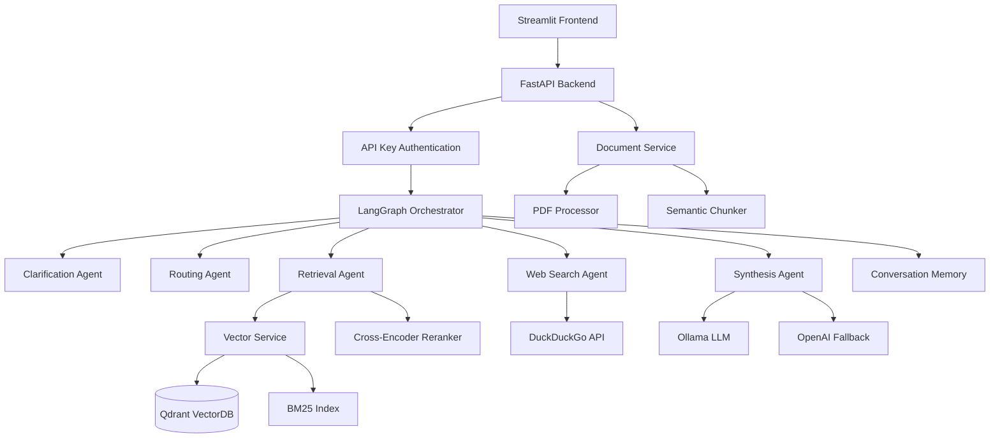

# PDF RAG System

A production-ready Retrieval-Augmented Generation (RAG) system for intelligent question-answering over PDF documents through upload, built with LangGraph multi-agent architecture and hybrid retrieval capabilities.

## 🚀 Features

- **Multi-Agent Architecture**: LangGraph-based orchestration with specialized agents for clarification, routing, retrieval, web search, and synthesis
- **Hybrid Retrieval**: Combines dense vector search (embeddings) with sparse keyword search (BM25) for superior retrieval accuracy
- **Intelligent Routing**: Automatically determines whether to search PDF documents, web sources, or both based on query analysis
- **Advanced Document Processing**: Semantic chunking with sentence-based splitting and overlap handling
- **Reranking**: Cross-encoder models for improved document relevance scoring
- **Streaming Responses**: Real-time answer generation with Server-Sent Events (SSE)
- **Session Management**: Conversation memory with configurable timeouts and cleanup
- **Evaluation Harness**: Comprehensive testing with ROUGE, BERTScore, and semantic similarity metrics
- **Production Ready**: Docker deployment, CI/CD pipeline, health checks, and monitoring hooks
- **Dual LLM Support**: Primary Ollama models with OpenAI fallback for reliability

## 🏗️ Architecture



## 🛠️ How It Works

### 1. Multi-Agent Workflow

The system uses a **LangGraph-based multi-agent architecture** that processes queries through specialized agents:

1. **Clarification Agent**: Detects ambiguous queries and requests clarification
2. **Routing Agent**: Determines whether to search PDFs, web, or both based on query analysis  
3. **Retrieval Agent**: Performs hybrid search on PDF documents with reranking
4. **Web Search Agent**: Searches current information using DuckDuckGo when needed
5. **Synthesis Agent**: Combines information from multiple sources into coherent answers

### 2. Hybrid Retrieval System

- **Dense Vector Search**: Uses `BAAI/bge-small-en-v1.5` embeddings for semantic similarity
- **Sparse Keyword Search**: BM25 for exact keyword matching
- **Fusion Strategy**: Combines results using weighted scoring (configurable α parameter)
- **Reranking**: Cross-encoder model (`BAAI/bge-reranker-base`) for final relevance scoring

### 3. Document Processing Pipeline

1. **PDF Extraction**: Uses `pdfminer.six` for robust text extraction
2. **Semantic Chunking**: Sentence-based splitting with configurable overlap
3. **Metadata Extraction**: Automatic title, author, and document info detection
4. **Vector Storage**: Chunks stored in Qdrant with metadata and embeddings

### 4. Real-World Query Handling

The system gracefully handles different query types:

- **Ambiguous Questions**: "How many examples are enough for good accuracy?" 
  → Clarification agent detects ambiguity and requests specifics
  
- **PDF-Only Queries**: "Which prompt template gave the highest zero-shot accuracy on Spider in Zhang et al. (2024)?"
  → Routes to PDF retrieval for academic paper analysis
  
- **Current Information**: "What did OpenAI release this month?"
  → Routes to web search for recent information

## 📋 Requirements

- Python 3.11+
- Docker & Docker Compose
- 12GB+ RAM (for Ollama models)
- GPU support recommended (NVIDIA 3000 series and upward)

## 🚀 Quick Start

### 1. Clone and Setup

```bash
git clone <repository-url>
cd pdf-rag-system

# Copy environment template
cp .env.example .env

# Edit .env with your OpenAI key (optional but recommended)
nano .env
```

### 2. Configure Environment (Optional)

```bash
# Optional - for better performance with OpenAI fallback
OPENAI_API_KEY=sk-your-openai-key

# The system works out of the box with default settings
```

### 3. Start the System

```bash
# Start all services (this may take a few minutes first time)
docker-compose up -d

# Wait for services to be ready
docker-compose logs -f backend  # Watch for "Application startup complete"
```

### 4. Initialize Ollama Model (First Time Only)

```bash
# Pull the model (this will take several minutes)
docker exec ollama ollama pull mistral

# Verify model is available
docker exec ollama ollama list
```

### 5. Access the Chat Interface

**Open your browser and go to: http://localhost:8501**

### 6. Upload Your PDF Documents

1. **Click the file upload button** in the sidebar
2. **Select your PDF files** (academic papers work best)
3. **Click "Upload & Process"**
4. **Wait for processing** (you'll see a progress indicator)

### 7. Start Asking Questions

Simply type your questions in the chat interface:

- "What is the main contribution of this paper?"
- "How many examples are enough for good accuracy?"
- "What did OpenAI release this month?" (will search the web)
- "Which prompt template gave the highest zero-shot accuracy?"

**That's it! No coding or curl commands needed.**

## 🎯 User Interface

### Primary Interface: Streamlit Web App

**Access at: http://localhost:8501**

The Streamlit interface provides:
- **📤 PDF Upload**: Drag and drop PDF files for processing
- **💬 Chat Interface**: Natural conversation with your documents  
- **📚 Document Management**: View, delete, and manage uploaded files
- **🔄 Session Control**: Clear conversation history when needed
- **📊 System Status**: Real-time health monitoring
- **💡 Example Questions**: Pre-built queries to get started

### How to Use:

1. **Upload Documents**: Use the sidebar to upload PDF files
2. **Wait for Processing**: System will extract text and create embeddings
3. **Ask Questions**: Type naturally in the chat interface
4. **View Sources**: Click on source references to see supporting text
5. **Check Confidence**: System shows confidence scores for answers

### Sample Questions:

The system handles various query types:
- **Academic Questions**: "What methodology did the authors use?"
- **Comparative Analysis**: "How do these results compare to previous work?"
- **Current Information**: "What's the latest news about this topic?" (searches web)
- **Specific Details**: "What was the accuracy on the Spider dataset?"

### API Access (Optional)

While the Streamlit interface is the primary way to use the system, developers can also access the REST API at `http://localhost:8000/docs` for integration purposes.

## 📊 Using the Evaluation System

The system includes built-in evaluation capabilities accessible through the web interface:

### Accessing Evaluation Features

While primarily accessed through the API, you can test system performance:

1. **Navigate to**: `http://localhost:8000/docs` 
2. **Find the evaluation endpoints** under the "evaluation" section
3. **Use the interactive API docs** to run evaluations
4. **Upload evaluation datasets** as JSON files

### Sample Questions to Test

Try these questions in the Streamlit interface to test different capabilities:

**PDF-Only Questions:**
- "What is the accuracy reported in the paper?"
- "Which dataset was used for evaluation?"
- "Who are the authors of this research?"

**Web Search Questions:**  
- "What's the latest news about AI?"
- "What did OpenAI announce recently?"
- "Current trends in machine learning?"

**Ambiguous Questions** (tests clarification):
- "How many examples are enough for good accuracy?"
- "What's the best approach for this?"
- "How does it perform?"

### Evaluation Metrics

The system automatically evaluates responses using:
- **ROUGE Scores**: N-gram overlap with reference answers
- **BERTScore**: Semantic similarity using BERT embeddings  
- **Semantic Similarity**: Cosine similarity between sentence embeddings
- **Confidence Scoring**: System's confidence in the generated answer

### Sample Evaluation Dataset

Check `evaluation/sample_dataset.json` for pre-built evaluation questions you can test.

## 🐳 Running with Docker

### Simple Deployment

```bash
# Start all services
docker-compose up -d

# Check that everything is running
docker-compose ps

# View logs if needed
docker-compose logs -f

# Access the application
open http://localhost:8501
```

### Stopping the System

```bash
# Stop all services
docker-compose down

# Stop and remove all data (complete reset)
docker-compose down -v
```

### Troubleshooting

```bash
# If Ollama model isn't available
docker exec ollama ollama pull mistral

# Check service health
curl http://localhost:8000/health

# Restart a specific service
docker-compose restart backend
```

## 🔧 Configuration

### Basic Configuration

The system works out of the box with default settings. For better performance, you can optionally configure:

**In your `.env` file:**

```bash
# Optional: OpenAI API key for better performance
OPENAI_API_KEY=sk-your-openai-key

# Optional: Change the Ollama model
OLLAMA_MODEL=mistral  # For better quality (requires more RAM)

# Optional: Adjust chunk size for your documents
CHUNK_SIZE=256  # Smaller chunks for precise answers
CHUNK_SIZE=1024 # Larger chunks for more context
```

### Advanced Settings

Most users don't need to change these, but you can customize:

| Setting | Default | Description |
|---------|---------|-------------|
| `RETRIEVAL_TOP_K` | `10` | How many document chunks to retrieve |
| `RERANK_TOP_K` | `3` | How many chunks to use for final answer |
| `CHUNK_SIZE` | `512` | Size of document chunks |
| `SESSION_TIMEOUT` | `3600` | Chat session timeout (seconds) |

### Performance Tuning

**For better quality answers:**
- Set `OPENAI_API_KEY` for OpenAI fallback
- Use larger Ollama models: `mistral`
- Increase `RERANK_TOP_K` to use more sources

**For faster responses:**
- Use smaller models: `mistral`
- Reduce `RETRIEVAL_TOP_K` to retrieve fewer chunks
- Smaller `CHUNK_SIZE` for faster processing

## 🚀 CI/CD Pipeline

The project includes a comprehensive GitHub Actions pipeline:

### Pipeline Stages

1. **Test**: Unit tests, integration tests, coverage reporting
2. **Lint**: Code formatting, import sorting, type checking, security scanning
3. **Build**: Docker image building and pushing to GitHub Container Registry
4. **Deploy**: Production deployment (customize for your infrastructure)

### Secrets Configuration

Configure these secrets in your GitHub repository:

```bash
OPENAI_API_KEY=sk-your-openai-key  # Optional, for testing with OpenAI
```

### Running Pipeline Locally

```bash
# Install act (GitHub Actions local runner)
# https://github.com/nektos/act

# Run tests locally
act -j test

# Run full pipeline
act
```

## 📈 Monitoring and Observability

### Health Checks

```bash
# Basic health
curl http://localhost:8000/health/

# Detailed health with dependencies
curl http://localhost:8000/health/detailed

# Service-specific health
curl http://localhost:8000/health/qdrant
curl http://localhost:8000/health/ollama
```

### Metrics and Logging

The system uses structured logging with JSON format:

```json
{
  "timestamp": "2024-01-15T10:30:00Z",
  "level": "info",
  "logger": "src.agents.orchestrator",
  "message": "Question processing complete",
  "session_id": "user123",
  "confidence": 0.85,
  "processing_time": 2.3
}
```

### Performance Monitoring

```bash
# Document statistics
curl -H "Authorization: Bearer your-api-key" \
  http://localhost:8000/documents/stats/overview

# Session statistics  
curl -H "Authorization: Bearer your-api-key" \
  http://localhost:8000/chat/sessions/user123/status
```

## 🔍 How the System Works Behind the Scenes

When you ask a question through the Streamlit interface, here's what happens:

### 1. **Question Analysis** 
- **Clarification Agent** checks if your question is clear or needs more details
- **Routing Agent** decides whether to search your PDFs, the web, or both

### 2. **Information Retrieval**
- **PDF Search**: Uses hybrid search (semantic + keyword) across your uploaded documents
- **Web Search**: Uses DuckDuckGo to find current information when needed  
- **Reranking**: Ranks the most relevant sources using AI

### 3. **Answer Generation**
- **Synthesis Agent** combines information from multiple sources
- Generates a comprehensive answer with proper citations
- Provides confidence scores and source references

### 4. **Smart Features**
- **Session Memory**: Remembers context from earlier in your conversation
- **Source Attribution**: Shows exactly which documents support each claim
- **Confidence Scoring**: Indicates how certain the system is about its answers
- **Ambiguity Handling**: Asks for clarification when questions are unclear

This multi-agent architecture ensures you get accurate, well-sourced answers whether you're asking about your specific documents or current events.

## 🔒 Security

### API Authentication

All endpoints (except health checks) require API key authentication:

```bash
curl -H "Authorization: Bearer your-api-key" \
  http://localhost:8000/protected-endpoint
```

### Security Best Practices

1. **Change Default API Key**: Never use the default API key in production
2. **Use HTTPS**: Always use HTTPS in production deployments  
3. **Network Security**: Restrict access to internal services (Qdrant, Ollama)
4. **Input Validation**: All inputs are validated using Pydantic models
5. **Rate Limiting**: Implement rate limiting for production use

### Recommended Production Security

```bash
# Use strong API keys
API_KEY=$(openssl rand -hex 32)

# Enable HTTPS with reverse proxy (nginx, traefik)
# Restrict network access to internal services
# Regular security updates for dependencies
```

## 🚧 Future Improvements

Planned enhancements (documented for development roadmap):

### Performance & Scalability
- **Metrics Integration**: Push metrics to Prometheus and Grafana for monitoring
- **Rate Limiting**: Add rate limiting middleware for API protection
- **Caching Layer**: Redis caching for frequent queries and embeddings
- **Horizontal Scaling**: Kubernetes deployment manifests
- **Load Balancing**: Multi-replica deployment with load balancing

### Security & Operations
- **Authentication**: JWT tokens and user management
- **Authorization**: Role-based access control (RBAC)
- **Audit Logging**: Comprehensive request/response logging
- **Secrets Management**: Integration with HashiCorp Vault or cloud secret managers
- **Backup Strategy**: Automated backups for Qdrant and document metadata

### Features
- **Multi-Modal Support**: Image and table extraction from PDFs
- **Advanced Chunking**: Semantic chunking using NLP models
- **Query Expansion**: Automatic query expansion for better retrieval
- **Federated Search**: Support for multiple document repositories
- **Real-time Updates**: Live document updates and re-indexing

### Quality & Reliability
- **A/B Testing**: Framework for testing different retrieval strategies
- **Performance Benchmarks**: Standardized evaluation datasets
- **Automated Evaluation**: Scheduled evaluation runs with alerting
- **Circuit Breakers**: Resilience patterns for external service failures

## 🤝 Contributing

1. Fork the repository
2. Create a feature branch (`git checkout -b feature/amazing-feature`)
3. Make your changes
4. Add tests for new functionality
5. Run the test suite (`pytest`)
6. Run code quality checks (`black`, `isort`, `flake8`)
7. Commit your changes (`git commit -m 'Add amazing feature'`)
8. Push to the branch (`git push origin feature/amazing-feature`)
9. Open a Pull Request

### Development Guidelines

- Follow PEP 8 style guidelines
- Add comprehensive tests for new features
- Update documentation for API changes
- Use structured logging for observability
- Add type hints for better code quality

## 📄 License

This project is licensed under the MIT License - see the [LICENSE](LICENSE) file for details.

## 🆘 Troubleshooting

### Common Issues

#### Can't Access the Chat Interface
```bash
# Check if services are running
docker-compose ps

# If not running, start them
docker-compose up -d

# Wait for services to be ready
docker-compose logs -f backend  # Wait for "startup complete"
```

#### "Backend service not available" Error in Streamlit
```bash
# Check backend health
curl http://localhost:8000/health

# If unhealthy, restart backend
docker-compose restart backend

# Check logs for errors
docker-compose logs backend
```

#### Ollama Model Not Found
```bash
# Pull the model manually (first time setup)
docker exec ollama ollama pull mistral

# Check available models
docker exec ollama ollama list

# Restart if needed
docker-compose restart ollama
```

#### PDF Upload Fails
```bash
# Check if document processing is working
docker-compose logs backend | grep "PDF"

# Ensure PDF is text-based (not scanned images)
# Try with a smaller PDF first (< 10MB)
```

#### Slow Responses
```bash
# Use OpenAI fallback for faster responses
# Add to .env: OPENAI_API_KEY=sk-your-key

# Or use a smaller/faster Ollama model
# Add to .env: OLLAMA_MODEL=qwen3:4b
```

#### Out of Memory Errors
```bash
# Use smaller models
OLLAMA_MODEL=qwen3:4b

# Reduce retrieval parameters in .env:
RETRIEVAL_TOP_K=5
CHUNK_SIZE=256
```

### Getting Help

1. **Check the browser console** for JavaScript errors in Streamlit
2. **View backend logs**: `docker-compose logs backend`
3. **Check system status** in the Streamlit sidebar
4. **Verify all services are running**: `docker-compose ps`
5. **Restart everything**: `docker-compose restart`

### Performance Tips

- **📄 Document Quality**: Text-based PDFs work better than scanned images
- **📏 Document Size**: Smaller PDFs (< 50 pages) process faster
- **🧠 Model Choice**: Add OpenAI API key for faster, higher-quality responses
- **💾 Memory**: Ensure you have at least 8GB RAM for stable operation

---

**🎯 Remember: The main interface is at http://localhost:8501 - no coding required!**

---

**Built with ❤️ using FastAPI, LangGraph, Qdrant, and Streamlit**